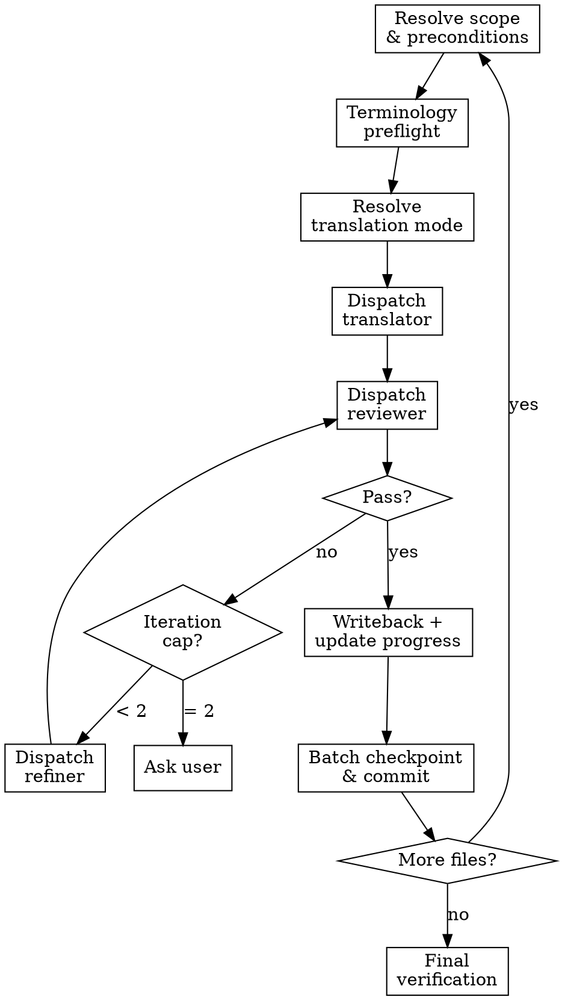

# Super Translate

## Overview

Iterative translation pipeline: `translator → reviewer → refiner` (max 2 iterations).

**Core principle:** No overwrite unless reviewer passes. Draft isolation until quality confirmed.

## Task Initialization (MANDATORY)

Before ANY action, create tasks using TaskCreate:
- One task per target file (sub-steps: draft, review, refine, writeback)
- One task for batch checkpoint
- One task for final verification

## The Process

### Step 1: Resolve Scope and Preconditions

1. Verify required files: `data/translation-progress.json`, `glossary.json`, `style-decisions.json`. Stop if missing.

2. Resolve target files:
   - `$ARGUMENTS` specifies files → use directly.
   - No args / `all` / `next` → auto-select from `translation-progress.json`:
     1. Resume `in_progress` files first.
     2. Then `not_started` in chapter order. Default batch = 3 files.
     3. Display and confirm:
        ```
        翻譯進度：已完成 X / Y 個章節
        本批次自動選取以下 N 個檔案：
        - [in_progress 繼續] <file>
        - [not_started 新增] <file>
        是否繼續？或請指定其他範圍。
        ```

**Verification:** Target file list confirmed by user; all 3 required files exist.

### Step 2: Terminology Preflight (Fail-Closed)

```bash
uv run python scripts/validate_glossary.py
uv run python scripts/term_read.py --fail-on-missing --fail-on-forbidden
```

If fails → stop and fix terminology first.

**Verification:** Both commands exit 0 with no missing/forbidden terms.

### Step 3: Resolve Translation Mode

Read `style-decisions.json.translation_mode.mode`. If missing, ask user:
- **完整翻譯**：完整翻譯所有內容，保留原始結構與細節
- **摘要翻譯**：精簡翻譯重點規則，省略範例與冗長說明

**Verification:** `translation_mode.mode` is persisted in `style-decisions.json`.

### Step 4: Pipeline Execution

**Pre-read shared context once per batch:**
- `GLOSSARY_CONTENT` = `glossary.json`
- `STYLE_CONTENT` = `style-decisions.json` (includes `translation_notes` as hard constraints)

**For each target file, run the pipeline:**

1. Update task → `in_progress`; update `translation-progress.json` → `in_progress`
2. Read source content; resolve draft path:
   ```bash
   uv run python scripts/draft.py --skill super-translate path <TARGET_FILE>
   ```
3. **Dispatch translator** (Agent tool, general-purpose) using `./translator-prompt.md`
   - Inline all context: source, glossary, style, draft path
   - Translator must not read files; all context is pre-inlined
4. Read draft content after translator returns
5. **Dispatch reviewer** (Agent tool, general-purpose) using `./reviewer-prompt.md`
   - Inline: source, draft, glossary, style
6. If reviewer fails → **dispatch refiner** using `./refiner-prompt.md`
   - Inline: source, draft, review JSON, glossary, style
   - Re-read draft → re-run reviewer. Cap at 2 total iterations.
7. If 2 iterations still fail, ask user:
   - **保留草稿，稍後手動修正**
   - **停止此檔案，先處理術語或規則歧義**

**Unknown terms:** Run `term_edit.py --set-zh` workflow, then rerun file.

**Parallel dispatch:** When batch has 2+ independent files and no shared terminology conflicts, dispatch multiple translator agents concurrently using Agent tool. Reviewer/refiner remain sequential per file.

**Verification:** Per file: reviewer JSON returns `"pass": true`, or iteration cap reached and user consulted.

### Step 5: Controlled Writeback

Only if reviewer passes:
```bash
uv run python scripts/draft.py --skill super-translate writeback <TARGET_FILE>
```

**Immediately** update `translation-progress.json`: status → `completed`, recalculate `_meta.completed`, update `_meta.updated`. Update task → `completed`.

If blocked: keep source unchanged, status stays `in_progress`, mark task blocked.

**Verification:** Writeback script exits 0; `translation-progress.json` shows file as `completed` with updated `_meta`; task marked `completed`.

### Step 6: Batch Checkpoint

After each batch:
1. Report: completed/blocked count, iteration counts, `已完成 X / Y 個章節`
2. Stage only batch-touched files and commit:
   ```bash
   git commit -m "progress: X/Y"
   ```
3. If remaining files exist → ask user to continue (re-run Step 1) or proceed to verification.

**Verification:** `git log -1` shows checkpoint commit with `progress: X/Y` message; report displayed to user.

### Step 7: Final Verification

```bash
uv run python scripts/validate_glossary.py
uv run python scripts/term_read.py --fail-on-missing --fail-on-forbidden
```

Invoke `check-consistency` skill. Resolve violations before marking run complete.

**Verification:** Both validation commands exit 0; `check-consistency` reports no violations; all tasks marked `completed`.

## Prompt Templates

Colocated with this skill. Orchestrator inlines all placeholders before dispatch:
- `./translator-prompt.md` — draft generation
- `./reviewer-prompt.md` — source fidelity + quality check
- `./refiner-prompt.md` — apply reviewer findings

## Flowchart



## Progress Sync Contract

1. Sync tasks and `translation-progress.json` at file start, every review loop, and file close.
2. NEVER defer sync until end-of-run.
3. Create batch checkpoint commit immediately after each completed batch.

## Red Flags

| Thought | Reality |
|---------|---------|
| "Just overwrite source, reviewer will pass next time" | Draft isolation exists for a reason. NEVER overwrite without pass. |
| "Skip task updates until the end" | Sync contract is per-file, not per-run. |
| "I'll invent a translation for this unknown term" | Run `term_edit.py --set-zh` workflow. No exceptions. |
| "Skip terminology preflight, it was fine last time" | Glossary changes between runs. Always preflight. |
| "One file left, no need for checkpoint commit" | Every completed batch gets a commit. No exceptions. |
| "I can batch-replace with regex for speed" | Manual translation only. Script-generated prose is forbidden. |

## When to Stop and Ask

- Repeated critical findings remain after iteration cap
- Subagent output is malformed and not safely recoverable
- Unknown term requires user decision (rare characters, puns, culturally nuanced)

## References

See `./translator-prompt.md`, `./reviewer-prompt.md`, `./refiner-prompt.md` for full dispatch context and placeholder specifications.
