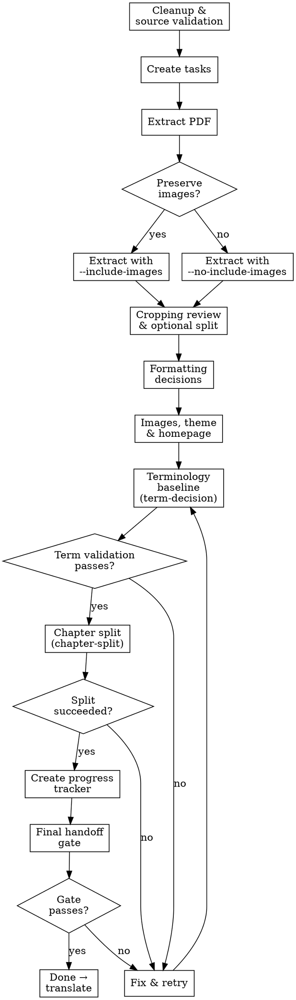

# Initialize Document Translation

## Overview

Initialize translation baseline from PDF extraction to chaptered docs, style decisions, glossary, and progress tracker.

**Core principle:** Build a deterministic, verifiable baseline before any large-scale translation.

## Task Initialization (MANDATORY)

Before ANY action, create tasks using TaskCreate:
- One task per major phase (extraction, formatting, images/theme, terminology, chapter split, progress tracker)
- One task for final handoff gate

## Interaction Rules

- All user interaction must be Traditional Chinese (zh-TW).
- AskUserQuestion prompts must be Traditional Chinese.
- Do not use Simplified Chinese in user-facing text.

## The Process

### Step 1: Cleanup and Source Validation

Run cleanup:

```bash
uv run python scripts/clean_sample_data.py --yes
```

Then resolve source PDF from `$ARGUMENTS` or ask user in Traditional Chinese. Ensure source is under `data/pdfs/`.

Before extraction, ask user in Traditional Chinese whether to preserve PDF images in the generated docs:

```text
是否要保留 PDF 內的圖片，並在切分後的 Markdown 文件中保留對應圖片連結？
```

Record this decision as `preserve_images: true/false` for the rest of the run.

**Verification:** Source PDF exists under `data/pdfs/`; `preserve_images` decision recorded; cleanup script exited 0.

### Step 2: Create Tasks

Create TaskCreate items for:
- extraction
- formatting decisions
- image retention decision
- image and theme setup
- terminology bootstrap
- chapter mapping
- progress tracker creation
- final handoff gate

**Verification:** All tasks created with correct descriptions; task list matches the phases above.

### Step 3: Extract and Validate Raw Outputs

Run:

```bash
uv run python scripts/extract_pdf.py <pdf_path> --include-images
```

If `preserve_images` is `false`, run instead:

```bash
uv run python scripts/extract_pdf.py <pdf_path> --no-include-images
```

Validate outputs:
- `data/markdown/<name>.md`
- `data/markdown/<name>_pages.md`
- `data/markdown/images/<name>/`（only when `preserve_images = true`）

**Verification:** All expected output files exist and are non-empty.

### Step 4: Cropping Review and Optional Split

Review readability and completeness.
If needed, split large source into parts and re-extract until clean.

**Verification:** Extracted markdown is readable; no garbled text or truncated sections remain.

### Step 5: Confirm Document Formatting Decisions

Summarize content to user in Traditional Chinese:

```text
書本內容概覽：
- 主要內容類型：[規則說明、範例場景、角色選項...]
- 特殊結構：[大量表格、骰表、設計者備註...]
- 建議可使用的格式化元件：[...]
```

Collect formatting choices (Traditional Chinese):
- layout profile for extraction (`auto` / `single-column` / `double-column`)
- aside mapping (`note/tip/caution/danger`) — must include a mapping for game examples (game examples should always be rendered as asides)
- card/tabs usage
- table/dice-table conventions

Persist via script:

```bash
uv run python scripts/style_decisions.py init
uv run python scripts/style_decisions.py set-document-format \
  --layout-profile "<auto|single-column|double-column>" \
  --aside-note "<note_component>" \
  --aside-tip "<tip_component>" \
  --aside-caution "<caution_component>" \
  --aside-danger "<danger_component>" \
  --cards-usage "<cards_usage_note>" \
  --tabs-usage "<tabs_usage_note>" \
  --tables-convention "<table_note>" \
  --dice-tables-convention "<dice_table_note>"
uv run python scripts/validate_style_decisions.py
```

**Verification:** `style-decisions.json` contains `document_format` section; `validate_style_decisions.py` exits 0.

### Step 6: Select Images, Theme, and Homepage Content

1. If `preserve_images = true`, ask user to assign extracted images for hero/background/og.
2. If `preserve_images = true`, copy and resize where needed.
3. If `preserve_images = false`, skip extracted image assignment and continue with theme-only setup.
4. Ask theme decisions in Traditional Chinese (mode/overlay/palette).
5. Update `docs/src/styles/custom.css` and persist style decisions.
6. Persist image retention decision via:

```bash
uv run python scripts/style_decisions.py set-images --preserve-images <true_or_false>
```
7. Ask for site meta in Traditional Chinese (all four fields):
   - **網站標題**（`site.title`）：首頁 `<title>` 及 frontmatter title，例：「Rapscallion 遊戲規則」
   - **首頁描述**（`site.description`）：SEO description，一句話
   - **副標語**（`site.tagline`）：hero 區塊顯示的一行短語
   - **內容簡介**（`site.intro`）：首頁「內容簡介」段落，一到兩句
   Persist via:

   ```bash
   uv run python scripts/style_decisions.py set-site \
     --title "<USER_INPUT>" \
     --description "<USER_INPUT>" \
     --tagline "<USER_INPUT>" \
     --intro "<USER_INPUT>"
   ```

9. Ask for copyright and credits in Traditional Chinese:
   - Copyright notice text（例：`© 2024 Author Name. All rights reserved.`）
   - Credits entries as role → name pairs（例：原作者、翻譯、美術設計等）
   - Whether to show each section on the homepage
10. Persist via:

```bash
uv run python scripts/style_decisions.py set-copyright \
  --text "<USER_INPUT>" \
  --show-on-homepage <true_or_false>
uv run python scripts/style_decisions.py set-credits \
  --entry "原作者:..." \
  --entry "翻譯:..." \
  --show-on-homepage <true_or_false>
```

11. Ask whether there are any translation-wide notes the translator must always follow.
    Persist each note via:

```bash
uv run python scripts/style_decisions.py add-translation-note \
  --key "<short_key>" \
  --topic "<optional_topic>" \
  --note "<USER_INPUT>"
```

If the note is specific to one source file or future appended document, use:

```bash
uv run python scripts/style_decisions.py add-translation-note \
  --document-key "<pdf_stem_or_doc_id>" \
  --key "<short_key>" \
  --note "<USER_INPUT>"
```

12. Run:

```bash
uv run python scripts/validate_style_decisions.py
```

`generate_nav.py` will render these as **## 版權宣告** and **## 製作名單** sections on the homepage. If neither is provided, a generic fallback disclaimer is used.

**Verification:** `validate_style_decisions.py` exits 0; `style-decisions.json` contains site meta, copyright, credits, and image decisions.

### Step 7: Build Terminology Baseline

Invoke `term-decision` skill for terminology bootstrap instead of duplicating the workflow here.

Required handoff to `term-decision`:
1. Source is the extracted markdown from this init run.
2. First inspect high-signal terminology sources in the original book:
   - source glossary / terminology pages
   - index pages
   - appendix term lists
   - playbook / move summary tables that clearly define recurring mechanics terms
3. Complete one first-pass terminology bootstrap from those sections:
   - prefill obvious term translations into `glossary.json`
   - keep wording consistent with `style-decisions.json`
   - ask the user only about uncertain, culturally nuanced, or mechanics-ambiguous terms
4. After that first pass, generate and verify the remaining candidates with:

```bash
uv run python scripts/term_generate.py --min-frequency 2
uv run python scripts/term_cal_batch.py
uv run python scripts/validate_glossary.py
uv run python scripts/term_read.py --fail-on-missing --fail-on-forbidden
```

`init-doc` must not continue to chapter split until the `term-decision` handoff completes cleanly.

**Verification:** `validate_glossary.py` and `term_read.py --fail-on-missing --fail-on-forbidden` both exit 0.

### Step 8: Chapter Split and Navigation

Invoke `chapter-split` skill instead of duplicating split logic here.

Required handoff to `chapter-split`:
1. Source is the extracted `_pages.md` file from this init run.
2. Reuse the `preserve_images` decision from Step 1.
3. Reuse the formatting and terminology decisions already completed in Steps 5-7.
4. Generate `chapters.json`, split docs output, and regenerate navigation.
5. If `chapter-split` reports unresolved critical issues, stop `init-doc` and resolve them before continuing.

**Verification:** `chapters.json` exists; split docs generated; nav regenerated.

### Step 9: Create Translation Progress Tracker

Create `data/translation-progress.json` from `chapters.json`:

```bash
uv run python scripts/init_create_progress.py --force
```

Tracker contract:
- chapter ids derived from output file paths
- source page ranges mapped from chapter config
- initial status `not_started`
- `_meta` fields (`updated`, `total_chapters`, `completed`)

**Verification:** `data/translation-progress.json` exists; contains all chapters from `chapters.json` with status `not_started`; `_meta` fields present.

### Step 10: Final Gate and Handoff (Fail-Closed)

Run one-shot handoff gate:

```bash
uv run python scripts/init_handoff_gate.py
```

If any gate fails, stop and fix before completion.

**Verification:** `init_handoff_gate.py` exits 0; all tasks marked `completed`.

## Flowchart



## Progress Sync Contract (Required)

1. Keep tasks updated via TaskUpdate at every step.
2. Mark blockers immediately and include failing command/context.
3. Close tasks only after final gate passes.

## When to Stop and Ask for Help

Stop when:
- source extraction repeatedly fails
- `chapter-split` cannot produce a usable config
- glossary validation cannot be resolved safely
- docs build fails with unclear root cause

## When to Revisit Earlier Steps

Return to earlier steps when:
- user changes formatting/theme policy
- user changes proper noun strategy
- source markdown changes enough to invalidate page mapping

## Red Flags

| Thought | Reality |
|---------|---------|
| "Validation failed but it's probably fine, keep going" | Fail-closed means stop. Fix the failure before proceeding. |
| "Skip chapter-split handoff and split manually" | Chapter-split skill ensures deterministic structure. Never bypass. |
| "User didn't answer about proper nouns, I'll just pick one" | User confirmation is required for formatting and proper noun policy. |
| "Progress tracker can be created later" | Tracker must be initialized before handoff. No exceptions. |
| "Skip terminology baseline, we can add terms during translation" | Terminology drift across chapters is costly. Bootstrap first. |
| "I'll reuse the old glossary without re-validating" | Glossary changes between runs. Always validate. |
| "One quick formatting change doesn't need style-decisions.json" | All formatting decisions must be persisted. No ad-hoc overrides. |

## Next Step

Continue with `/translate` or `/super-translate`.

## Example Usage

```text
/init-doc
/init-doc data/pdfs/rulebook.pdf
```
