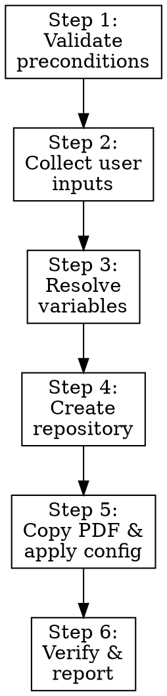

# Create New Project from Template

## Overview

Create a new game documentation project from template, configure repository metadata, and prepare source PDF for initialization.

**Core principle:** Ask once, create deterministic project state, verify immediately, then hand off.

## Task Initialization (MANDATORY)

Before ANY action, create tasks using TaskCreate:
- One task per major step (preconditions, user inputs, repo creation, PDF + config, verification)

## The Process

### Step 1: Validate Preconditions

Confirm:
- `gh` is installed and authenticated
- `git` is configured
- source PDF path exists

If any check fails, stop and report exact remediation.

**Verification:** `gh auth status` exits 0; `git config user.name` non-empty; PDF exists.

### Step 2: Ask User Inputs in Traditional Chinese

Collect via AskUserQuestion:

1. Project path
- header: `專案路徑`
- question: `請問新專案要建立在哪個路徑？`

2. Game zh-TW title
- header: `遊戲名稱`
- question: `請問這款遊戲的繁體中文名稱是什麼？`

3. Project slug (if missing from arguments)
- header: `專案代號`
- question: `請問資料夾與 GitHub repo 要使用哪個名稱？`

4. Repository visibility
- header: `儲存庫類型`
- question: `GitHub 儲存庫要設為公開還是私有？`

**Verification:** All four inputs collected and confirmed by user.

### Step 3: Resolve Variables

```bash
TEMPLATE_ROOT="<current_workspace_root>"
CLONE_SCRIPT="$TEMPLATE_ROOT/gh-clone.sh"
TARGET_DIR="<user_path>/<project_name>"
PDF_PATH="<pdf_path>"
GAME_TITLE_EN="<derived_from_pdf_filename>"
GAME_TITLE_ZH="<user_input>"
REPO_VISIBILITY="<private_or_public>"
REPO_URL="https://github.com/<username>/<project_name>"
```

**Verification:** All variables resolved to concrete values; no placeholders remain.

### Step 4: Create Repository

Preferred path:

```bash
cd <user_path>
if [ "$REPO_VISIBILITY" = "public" ]; then
  "$CLONE_SCRIPT" <project_name> --public
else
  "$CLONE_SCRIPT" <project_name>
fi
```

Fallback local-copy path:

```bash
cp -r "$TEMPLATE_ROOT" <TARGET_DIR>
cd <TARGET_DIR>
rm -rf .git
git init
gh repo create <project_name> --$REPO_VISIBILITY --source=. --remote=origin
git add .
git commit -m "Initial commit from game-doc-template"
git push -u origin main
```

**Verification:** `git remote -v` shows origin; `gh repo view` accessible.

### Step 5: Copy PDF and Apply Configuration

Copy PDF:

```bash
mkdir -p data/pdfs
cp "<pdf_path>" data/pdfs/
```

Update:
- `docs/astro.config.mjs` title and (if public) GitHub social link
- initialize and update `style-decisions.json` via scripts
- `CLAUDE.md` project description

Use:

```bash
uv run python scripts/style_decisions.py init
uv run python scripts/style_decisions.py set-repository \
  --slug "<project_name>" \
  --visibility "<private_or_public>" \
  --url "<REPO_URL>" \
  --show-on-homepage <true_or_false>
uv run python scripts/validate_style_decisions.py
```

**Verification:** PDF exists in `data/pdfs/`; config files updated.

### Step 6: Verify and Report

Verify:

```bash
ls -la
ls -la data/pdfs/
ls -la docs/
git remote -v
```

Report in Traditional Chinese:

```text
✓ 專案已建立：<project_name>
✓ 遊戲名稱：<GAME_TITLE_EN>（<GAME_TITLE_ZH>）
✓ 專案路徑：<TARGET_DIR>
✓ Repo 類型：<REPO_VISIBILITY>
✓ GitHub repo：https://github.com/<username>/<project_name>
✓ PDF 已複製到：data/pdfs/<filename>

下一步：
1. cd <TARGET_DIR>
2. 執行 /init-doc
```

**Verification:** All prior verifications pass; report displayed to user.

## Flowchart



## Progress Sync Contract (Required)

1. Update tasks via TaskCreate/TaskUpdate after each major step.
2. Mark blockers immediately with reason.
3. Do not claim completion with open critical items.

## When to Stop and Ask for Help

Stop when:
- repo name is unavailable and no approved fallback exists
- auth or permission errors block creation
- source PDF path remains invalid

## When to Revisit Earlier Steps

Return to input/variable steps when:
- user changes path/name/visibility
- source PDF changes

## Red Flags

| Thought | Reality |
|---------|---------|
| "Create repo without confirming user decisions" | All required inputs must be collected and confirmed first. |
| "Expose private repo URL in public homepage links" | Private repo URLs must never appear in public-facing config. |
| "Skip verification before reporting success" | Every step has a verification gate. Never skip. |

## Next Step

Continue with `/init-doc`.

## Example Usage

```text
/new-project ~/Downloads/Blades-in-the-Dark.pdf
/new-project ~/Downloads/game.pdf my-game-docs
```
