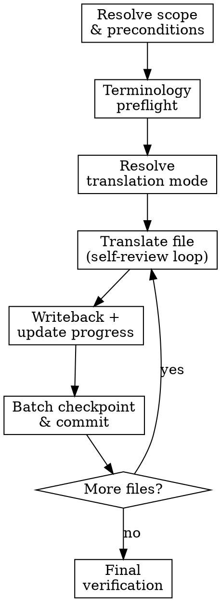

# Translate Document

## Overview

Single-pass translation of markdown content to Traditional Chinese with glossary compliance, draft isolation, progress tracking, and one Git checkpoint commit per completed batch.

**Core principle:** Draft first, verify before writeback, never overwrite source with unverified output.

## Task Initialization (MANDATORY)

Before ANY action, create tasks using TaskCreate:
- One task per target file
- One task for batch checkpoint
- One task for final verification

## The Process

### Step 1: Resolve Scope and Preconditions

1. Verify required files exist:
   - `glossary.json`
   - `style-decisions.json`
   - `data/translation-progress.json`
   If any are missing, stop and ask user to run `/init-doc` first.

2. Resolve target files:
   - If `$ARGUMENTS` specifies concrete file paths or a scoped pattern → use those directly as the current batch.
   - Otherwise (no args, `all`, or `next`) → **auto-select from `translation-progress.json`**:
     1. **Resume first**: collect all files with status `in_progress` (highest priority).
     2. **Then queue**: collect files with status `not_started`, in chapter order.
     3. Display selected files to user in Traditional Chinese before proceeding:
        ```
        翻譯進度：已完成 X / Y 個章節
        本批次已從進度表自動選取以下檔案：
        - [in_progress 繼續] <file>
        - [not_started 新增] <file>
        …
        是否繼續？或請指定其他範圍。
        ```
     4. Wait for user confirmation or override.
   - The selected target set for this run is one batch. If only one file is selected, that single file is the batch.

**Verification:** Target file list confirmed; all required files exist.

### Step 2: Terminology Preflight (Fail-Closed)

```bash
uv run python scripts/validate_glossary.py
uv run python scripts/term_read.py --fail-on-missing --fail-on-forbidden
```

If preflight fails, stop and fix terminology first.

**Verification:** Both commands exit 0.

### Step 3: Resolve Translation Mode

Read `style-decisions.json.translation_mode.mode`.
If missing, ask user in Traditional Chinese:
- **完整翻譯**：完整翻譯所有內容，保留原始結構與細節
- **摘要翻譯**：精簡翻譯重點規則，省略範例與冗長說明

Persist mode before translating.

**Verification:** `translation_mode.mode` persisted in `style-decisions.json`.

### Step 4: Prepare Draft Directory

For each target file, obtain its draft path (this also creates the directory):

```bash
uv run python scripts/draft.py --skill translate path <TARGET_FILE>
```

Use the printed path as `<DRAFT_FILE>` for that file.

**Verification:** Draft path returned; directory exists.

### Step 5: Translate Per File

For each target file:

1. Mark task item `in_progress`
2. Update `translation-progress.json` status to `in_progress`
3. Read source content, `glossary.json`, and `style-decisions.json`（特別包含 `translation_notes`）
4. Get draft path:
   ```bash
   DRAFT_FILE=$(uv run python scripts/draft.py --skill translate path <TARGET_FILE>)
   ```
   Translate to `$DRAFT_FILE`:
   - Draft/source mapping is stored in `.claude/skills/translate/.state/draft-manifest.json`; do not add translation metadata to frontmatter
   - Traditional Chinese only (Taiwan usage), no Simplified Chinese
   - Preserve markdown structure exactly (frontmatter, headings, lists, tables, links, code blocks)
   - Follow every applicable note in `style-decisions.json.translation_notes`
   - Treat `frontmatter.title` as the page title; do not restate it anywhere in the body as a heading of any level (`#`, `##`, etc.)
   - If the source page opens with an overview/introduction block that has no heading, translate it as plain body content; do not invent a `#` or `## 概覽` heading
   - Preserve image links exactly; if an image link appears within the source flow for a paragraph, keep the same link but place it near the middle of the translated paragraph instead of splitting the paragraph into separate blocks
   - Use glossary mappings exactly
   - Manual translation only (no script-generated prose)
   - Do NOT overwrite source file; write only to `$DRAFT_FILE`
5. Self-review the draft against source:
   - Missing or truncated content?
   - Glossary violations?
   - Violated any item in `style-decisions.json.translation_notes`?
   - Markdown structure broken?
   - Added any heading of any level that simply restates `frontmatter.title`?
   - Added `概覽`/overview heading that does not exist in the source?
   - Image links preserved and kept inside the paragraph flow without splitting the paragraph?
   - Full-width punctuation correct?
   - Content contamination: any paragraph or block that has no corresponding source in the original file?
   - Untranslated English: any English left untranslated (excluding code/dice notation such as `1d6`, `+2`)? Covers body text, headings, table cells, and game labels (status conditions, item tags, rule keywords/phrases). Terminology must match `glossary.json`; proper nouns follow `style-decisions.json` policy.
   - Fix any issues found in the draft directly
6. Writeback:
   ```bash
   uv run python scripts/draft.py --skill translate writeback <TARGET_FILE>
   ```
7. **Immediately** update `translation-progress.json`:
   - Set file status to `completed`
   - Recalculate `_meta.completed` (count of completed entries)
   - Update `_meta.updated` to current timestamp
   Do NOT defer this update; write it before moving to the next file.
8. Mark task item completed

**Unknown term handling:**

```bash
uv run python scripts/term_edit.py --term "<TERM>" --set-zh "<ZH>" --status approved --mark-term
uv run python scripts/term_read.py --fail-on-forbidden
```

Then continue translating with the updated glossary.

**Verification:** Self-review checklist passes; writeback exits 0; progress JSON updated.

### Step 6: Batch Checkpoint Commit

After all files in the current batch are processed:

1. Run `git status --short` and verify batch scope before staging.
2. Stage **only** files touched by this batch:
   - completed translated source files from this batch
   - `data/translation-progress.json`
   - `glossary.json` if changed in this batch
   - `style-decisions.json` if changed in this batch
3. Create one checkpoint commit for the batch:

```bash
git commit -m "progress: X/Y"
```

4. Commit message rules:
   - keep it short and progress-only
   - use the current completion count from `translation-progress.json`
   - do not mention filenames, rationale, or extra prose
5. Never stage or commit unrelated user changes.
6. If no file reached `completed` in this batch, skip the commit.

**Verification:** `git log -1` shows progress commit.

### Step 7: Final Verification

```bash
uv run python scripts/validate_glossary.py
uv run python scripts/term_read.py --fail-on-missing --fail-on-forbidden
```

Mark final verification task item completed.

**Verification:** Both validation commands exit 0; all tasks completed.

## Flowchart



## Progress Sync Contract (Required)

1. Sync task list and `translation-progress.json` at file start and file close.
2. Never defer sync until end-of-run.
3. Create the batch checkpoint commit immediately after batch completion; do not postpone it to a later batch.

## Red Flags

| Thought | Reality |
|---------|---------|
| "Just overwrite source, I'll review later" | Draft isolation exists for a reason. NEVER overwrite without self-review. |
| "Skip task updates until the end" | Sync contract is per-file, not per-run. |
| "I'll invent a translation for this unknown term" | Run `term_edit.py --set-zh` workflow. No exceptions. |
| "Skip terminology preflight, it was fine last time" | Glossary changes between runs. Always preflight. |
| "One file left, no need for checkpoint commit" | Every completed batch gets a commit. No exceptions. |
| "I can batch-replace with regex for speed" | Manual translation only. Script-generated prose is forbidden. |
| "I'll add a heading to restate the title" | Never restate `frontmatter.title` as a body heading. |
| "I'll add an overview heading for clarity" | Never invent a heading that does not exist in the source. |

## When to Stop and Ask for Help

Stop when:
- mode policy is unclear
- source text ambiguity changes mechanics meaning
- repeated terminology conflicts block translation integrity

## When to Revisit Earlier Steps

Return to Step 1 or 3 when:
- target scope changes
- translation mode changes
- glossary decisions change materially

## Next Step

After translation, run `/check-consistency` and `/check-completeness` as needed.

If `translation-progress.json` shows all files are `completed` after this batch, invoke the `final-proofread` skill to run the three-gate quality sweep before publishing.

## Example Usage

```text
/translate
/translate docs/src/content/docs/rules/basic.md
/translate rules
/translate all
```
